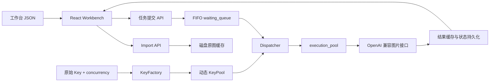

<div align="center">

# High TPS Image Workbench

### 面向 OpenAI 兼容图片接口的高并发工作台


**Import → Cache → Waiting Queue → Execution Pool → Upstream → Persist**

[工作台](#前端工作台) · [Core 与 KeyPool](#后端-core) · [测试服务器](#固定图片测试服务器) · [快速启动](#快速启动) · [API](#api-概览)

</div>

---

High TPS Image Workbench 是一个本地图片批处理与并发调度项目。一个 Block 对应一个 Listing，每个 Block 可包含 1–20 张图片；前端负责导入、展示和提交任务，后端负责持久化、FIFO 排队、KeyPool 租用和上游请求转发。

项目同时提供一个固定图片测试服务器：无需真实 API Key，任何生成请求都会在模拟延迟后返回同一张白底 `TEST` 图片，适合验证 300 图导入、动态并发、队列扩缩容和完整日志链路。

## 当前设计原则

- 所有新任务首先进入 `waiting_queue`。
- `execution_pool` 不设置额外的软件并发上限；健康 Key 副本有多少，最多就并发执行多少个任务。
- 同一个真实 API Key 按 `concurrency` 复制为多个可租用副本；API Key 相同，但每个副本的 `keyID` 唯一。
- Dispatcher 严格从队首取任务，只有成功租到支持目标模型的 Key 副本后，任务才进入 `execution_pool`。
- Core 对每次任务只请求上游一次，不执行自动 retry、attempt 或熔断重试。
- 失败任务进入 `failed`，由用户在工作台点击“重新生成”后重新提交。
- `queue.maxPending` 只限制等待队列；队列满时新请求返回 HTTP `503 QUEUE_FULL`。
- 导入的原图、Block 信息、Prompt、任务状态和生成结果落盘保存，刷新页面不会丢失。

## 系统架构



任务生命周期：

```text
REQUEST_ACCEPTED
  → QUEUED
  → ACCEPTED_RESPONSE_SENT
  → EXECUTING
  → UPSTREAM_REQUEST_SENT
  → UPSTREAM_RESPONSE_RECEIVED
  → COMPLETED / FAILED
  → FINAL_RESPONSE_SENT
```

Core Control 页面会分别实时显示 `execution_pool`、`waiting_queue` 和追加式事件日志。请求结构、脱敏后的上游请求、响应状态、Task ID、Block/Image 编号和 Key ID 都可以展开查看。

## 功能概览

### 前端工作台

- 导入 Block JSON，并通过后端缓存所有远程原图。
- 一个 Block 对应一个 Listing 和 1–20 张图片。
- 图片统一显示为 `IMAGE 01`、`IMAGE 02`……，不再使用 `front`、`detail` 等业务标签。
- Block Prompt 作为默认 Prompt，单图 Prompt 可覆盖它。
- 支持开始全部、开始当前 Block、生成单张和重新生成单张。
- 每个 Block 的图片固定在一行，超出宽度后横向滚动。
- 展示输入图、输出图、状态、错误、下载入口和完整运行日志。
- 自动从后端恢复已导入的 Block、任务状态和输出结果。

### 后端 Core

- Fastify HTTP API。
- 严格 FIFO 的 `waiting_queue`。
- 由 KeyPool 物理副本数量驱动的 `execution_pool`。
- Key 注册、编辑、删除、启用/停用和动态重建。
- 按模型匹配 Key 副本。
- 原始 Key 去重健康检查。
- OpenAI 兼容 JSON generation 与 multipart image edit 转发。
- 请求和响应 Trace 自动脱敏，不向浏览器暴露明文 API Key 或本地绝对路径。
- Queue 容量支持运行时动态扩容、缩容。
- 工作台原图、结果图与元数据磁盘持久化。
- 无自动重试；错误立即成为明确终态。

### 固定图片测试服务器

- 零第三方依赖，使用 Node.js 原生 HTTP Server。
- 默认监听 `3100` 端口。
- `/test.png` 立即返回固定白底 `TEST` PNG，用作导入原图。
- 其他任意路径均模拟图片生成接口，并返回 OpenAI 风格 `b64_json`。
- 默认等待 3 秒，模拟真实图片服务耗时。
- 输出 method、path、请求字节数、响应字节数和耗时日志。
- 可用任意测试 API Key 注册到 Core。

## 快速启动

### 1. 环境要求

- Node.js 18 或更高版本
- npm
- Windows、macOS 或 Linux

### 2. 安装依赖

```bash
npm install
npm --prefix client install
```

测试服务器没有第三方依赖，不需要单独安装。

### 3. 启动三个服务

终端 1：启动固定图片测试服务器。

```bash
npm run mock:start
```

终端 2：启动后端 Core。

```bash
npm start
```

终端 3：启动前端工作台。

```bash
npm run dev:client
```

本机访问地址：

| 服务 | 地址 |
|---|---|
| 前端工作台 | `http://127.0.0.1:5173/` |
| Core Control | `http://127.0.0.1:5173/#core` |
| 后端健康检查 | `http://127.0.0.1:3000/health` |
| 测试原图 | `http://127.0.0.1:3100/test.png` |

> `0.0.0.0` 是服务端监听地址，不是浏览器访问地址。本机浏览器请使用 `127.0.0.1` 或 `localhost`。

### 4. 注册测试 Key

打开 Core Control，填写：

| 字段 | 测试值 |
|---|---|
| Name | `Local Mock` |
| Base URL | `http://127.0.0.1:3100` |
| API Key | `test` |
| Models | `gpt-image-1` |
| Concurrency | 按需要填写，例如 `10` 或 `100` |

也可以直接调用 API：

```bash
curl -X POST http://127.0.0.1:3000/api/keys \
  -H "Content-Type: application/json" \
  -d '{
    "id": "local-mock",
    "name": "Local Mock",
    "baseUrl": "http://127.0.0.1:3100",
    "apiKey": "test",
    "models": ["gpt-image-1"],
    "concurrency": 10,
    "enabled": true
  }'
```

注册成功后会创建：

```text
local-mock:1:1
local-mock:1:2
...
local-mock:1:10
```

它们共享同一个测试 API Key，但都是可独立租用的 KeyPool 副本。

### 5. 导入测试 JSON

- 小型结构示例：`client/example.workbench.json`
- 300 图并发测试：`client/test.workbench.json`

在工作台点击“导入 JSON”，等待原图缓存完成，然后点击“开始全部”。

## 前端工作台

前端使用 React 19、TypeScript 和 Vite。Vite 直接提供 `client/config.json`，项目不依赖 `public/` 目录。

### 前端配置

文件：`client/config.json`

```json
{
  "server": {
    "protocol": "http",
    "host": "127.0.0.1",
    "port": 3000
  },
  "poll_interval_ms": 1000,
  "ui": {
    "title": "Workbench",
    "default_model": "gpt-image-1",
    "image_size": "1024x1024"
  }
}
```

| 配置 | 说明 |
|---|---|
| `server.protocol` | Core 协议 |
| `server.host` | Core 主机 |
| `server.port` | Core 端口 |
| `poll_interval_ms` | 任务状态与 Core 面板轮询间隔 |
| `ui.title` | 页面标题 |
| `ui.default_model` | 默认提交模型，必须能匹配已注册 Key |
| `ui.image_size` | 上游图片请求尺寸 |

前端不再通过 `req_max_limit` 限制 Core 执行并发。任务按 JSON 顺序提交给后端，真正的执行并发只取决于当前健康、启用且模型匹配的 KeyPool 副本数。

### 工作台 JSON 格式

根节点既可以是 Block 数组，也可以是 `{ "blocks": [...] }`。

```json
[
  {
    "blockId": "ceramic-vase-001",
    "listing": "Minimal Handmade Ceramic Vase",
    "prompt": "Create a clean ecommerce product photo on a warm neutral background.",
    "images": [
      {
        "url": "http://127.0.0.1:3100/test.png"
      },
      {
        "url": "http://127.0.0.1:3100/test.png",
        "prompt": "Create a close-up product detail image."
      }
    ]
  }
]
```

校验规则：

- JSON 必须至少包含一个 Block。
- `blockId` 必须唯一，只允许字母、数字、下划线和短横线，长度 1–100。
- `listing` 必填。
- 每个 Block 必须包含 1–20 张图片。
- `url` 必须是可访问的 HTTP 或 HTTPS 地址。
- Block 的 `prompt` 是默认 Prompt。
- 图片的 `prompt` 可选，存在时覆盖 Block Prompt。
- 导入器按数组顺序生成 `01`、`02`、`03`……作为 Image ID。
- 输入 JSON 中旧的 `imageId: "front"`、`imageId: "detail"` 等字段会被忽略。

### 导入与缓存

导入时不是把远程 URL 留给浏览器临时显示，而是由后端下载并缓存原图：

```text
POST /api/workbench/import
  → 校验 JSON
  → 按 workbench.importConcurrency 下载原图
  → 校验文件大小与类型
  → 保存 blocks.json / tasks.json / inputs
  → 返回可恢复的工作台快照
```

提交任务时，请求体仍携带原始 `imageUrl` 用于审计和一致性校验；Core 真正发给上游的是磁盘中已缓存的图片二进制。

## 后端 Core

### Queue + Pool 模型

```text
客户端提交
    ↓
waiting_queue（严格 FIFO，容量由 queue.maxPending 控制）
    ↓ 仅当能够租到匹配的 Key 副本
execution_pool（容量 = 当前 KeyPool 物理副本数）
    ↓
上游图片服务
```

假设存在：

- Key A：`concurrency = 3`
- Key B：`concurrency = 7`
- 两个 Key 都健康、启用并支持目标模型

那么 execution pool 的理论并发容量就是 `3 + 7 = 10`。Core 不会再人为限制为 3，也不会把 Queue 容量切一半作为执行窗口。

任务提交后即使 execution pool 有空位，也会先形成 `QUEUED` 事件，再由 Dispatcher 从队首租 Key 并进入 `EXECUTING`，从而保持统一、可审计的生命周期。

### KeyPool

每个原始 Key 包含：

```json
{
  "id": "provider-a",
  "name": "Provider A",
  "baseUrl": "https://api.example.com",
  "apiKey": "secret",
  "models": ["gpt-image-1"],
  "concurrency": 5,
  "enabled": true
}
```

运行时 KeyFactory 会创建 5 个完整副本：

```text
provider-a:1:1
provider-a:1:2
provider-a:1:3
provider-a:1:4
provider-a:1:5
```

- `provider-a` 是原始 Source Key ID。
- 中间数字是 generation；更新 Key 配置会重建新 generation。
- 最后数字是副本编号。
- 副本租出后为 `leased`，任务结束后归还为 `available`。
- 停用或健康检查失败时，不再租出该 Source 的空闲副本。
- 健康检查按原始 Source Key 执行，不会对重复副本重复请求。
- 上游返回 `401` 或 `403` 时，Source Key 会被标记为不健康。
- API 返回的 Key 信息只包含掩码，不包含明文密钥。

真实 Key 默认保存到 `data/apikey_pool.json`，该文件已在 `.gitignore` 中排除。结构模板见 `data/apikey_pool.example.json`。

### 请求转发

普通任务使用：

```http
POST {baseUrl}/v1/images/generations
Content-Type: application/json
```

工作台图片任务使用：

```http
POST {baseUrl}/v1/images/edits
Content-Type: multipart/form-data
```

multipart 字段包括：

- `model`
- `prompt`
- `size`
- `n`
- `image`

Core 会添加：

- `Authorization: Bearer <API Key>`
- `x-relay-task-id`
- `x-relay-key-id`

管理 UI 中的 Trace 会将 Authorization 显示为 `[REDACTED]`。

### 无自动重试

Core 不实现 attempt retry 或 CircuitBreaker 重试。一次 Task 只对应一次上游请求：

```text
成功 → completed
超时 → failed
网络错误 → failed
非 2xx → failed
```

用户点击“重新生成”时，前端会创建一个新的 Task ID，再次进入 waiting queue。这使每次真实请求都能在日志中明确追踪。

## 后端配置

文件：根目录 `config.json`

```json
{
  "server": {
    "host": "0.0.0.0",
    "port": 3000,
    "logger": true
  },
  "queue": {
    "maxPending": 10000,
    "terminalTtlMs": 1800000
  },
  "request": {
    "timeoutMs": 120000,
    "imagePath": "/v1/images/generations",
    "imageEditPath": "/v1/images/edits"
  },
  "result": {
    "resultTtlMs": 1800000,
    "deleteAfterRead": true
  },
  "health": {
    "enabled": true,
    "runOnStart": false,
    "intervalMs": 30000,
    "timeoutMs": 10000,
    "path": "/v1/models"
  },
  "keys": {
    "storePath": "data/apikey_pool.json"
  },
  "workbench": {
    "cachePath": "data/workbench-cache",
    "maxImageBytes": 26214400,
    "downloadTimeoutMs": 60000,
    "importConcurrency": 5
  }
}
```

| 分组 | 配置 | 说明 |
|---|---|---|
| `server` | `host`, `port`, `logger` | 后端监听与结构化日志 |
| `queue` | `maxPending` | waiting queue 最大任务数 |
| `queue` | `terminalTtlMs` | Core 内存终态任务保留时间 |
| `request` | `timeoutMs` | 单次上游请求超时 |
| `request` | `imagePath` | JSON 图片生成路径 |
| `request` | `imageEditPath` | multipart 图片编辑路径 |
| `result` | `resultTtlMs` | 内存 ResultStore 保留时间 |
| `result` | `deleteAfterRead` | 前端取走结果后删除内存副本 |
| `health` | `enabled` | 是否启用定时健康检查 |
| `health` | `runOnStart` | 启动后是否立即检查 |
| `health` | `intervalMs` | 健康检查间隔 |
| `health` | `timeoutMs` | 健康检查超时 |
| `health` | `path` | 健康检查路径 |
| `keys` | `storePath` | 原始 Key 持久化路径 |
| `workbench` | `cachePath` | 工作台磁盘缓存目录 |
| `workbench` | `maxImageBytes` | 单张导入图片最大字节数 |
| `workbench` | `downloadTimeoutMs` | 导入原图下载超时 |
| `workbench` | `importConcurrency` | 导入阶段并发下载原图数 |

### 动态调整等待队列

Core Control 可以直接修改 Queue 容量，也可以调用：

```bash
curl -X PATCH http://127.0.0.1:3000/api/queue \
  -H "Content-Type: application/json" \
  -d '{ "maxPending": 5000 }'
```

- 扩容立即生效。
- 缩容不会删除或取消已有等待任务。
- 当当前等待数高于新上限时，Core 拒绝新任务，直到队列下降到上限以下。
- 运行时修改不会回写 `config.json`，重启后恢复磁盘配置。

## 固定图片测试服务器

目录：`mock-image-server/`

配置：`mock-image-server/config.json`

```json
{
  "host": "0.0.0.0",
  "port": 3100,
  "delayMs": 3000,
  "imageSize": 512,
  "logging": true
}
```

| 配置 | 说明 |
|---|---|
| `host` | 监听地址 |
| `port` | 测试服务器端口 |
| `delayMs` | 生成/编辑请求模拟耗时，默认 3 秒 |
| `imageSize` | 固定测试 PNG 尺寸 |
| `logging` | 是否输出每次请求的 JSON 日志 |

路径行为：

| 路径 | 行为 |
|---|---|
| `/test.png` | 立即返回 PNG，不应用 3 秒延迟 |
| `/v1/models` | 返回测试 JSON，可用于健康检查 |
| `/v1/images/generations` | 延迟后返回带 `b64_json` 的固定图片 |
| `/v1/images/edits` | 完整读取 multipart，延迟后返回固定图片 |
| 其他任意路径 | 延迟后返回相同兼容 JSON |

之所以让 `/test.png` 不延迟，是因为它用于导入阶段缓存原图；否则导入 300 张图片会无意义地等待数分钟。3 秒延迟只模拟真正的上游生成或编辑请求。

## 数据持久化

默认目录：

```text
data/
├─ apikey_pool.example.json
├─ apikey_pool.json                 # 真实 Key，不提交 Git
└─ workbench-cache/                 # 工作台缓存，不提交 Git
   ├─ blocks.json
   ├─ tasks.json
   ├─ inputs/
   │  └─ <blockId>/<imageId>.<ext>
   └─ outputs/
      └─ <blockId>/<imageId>.<ext>
```

刷新页面后，前端通过 `GET /api/workbench` 恢复 Block、Prompt、图片和任务结果。

注意：

- 工作台元数据、输入图和输出图可跨后端重启恢复。
- Core 的 waiting queue 与 execution pool 是单进程内存状态。
- 后端重启时，未完成任务不会继续执行，需要用户重新提交。
- “清空缓存”会删除当前工作台缓存。

## API 概览

### 系统状态

| Method | Path | 说明 |
|---|---|---|
| `GET` | `/health` | 服务存活检查 |
| `GET` | `/api/status` | Queue、KeyPool、Dispatcher 与阻塞诊断 |

### Key 管理

| Method | Path | 说明 |
|---|---|---|
| `GET` | `/api/keys` | 原始 Key 列表与统计 |
| `GET` | `/api/keys/pool` | KeyPool 副本快照 |
| `POST` | `/api/keys` | 注册 Key |
| `PUT` | `/api/keys/:id` | 更新并重建 Key 副本 |
| `DELETE` | `/api/keys/:id` | 删除 Key |
| `POST` | `/api/keys/:id/toggle` | 启用/停用 |
| `POST` | `/api/keys/:id/health-test` | 检查单个原始 Key |
| `POST` | `/api/keys/health-test` | 检查所有原始 Key |

### Queue 与任务

| Method | Path | 说明 |
|---|---|---|
| `GET` | `/api/queue` | Queue 统计与动态容量 |
| `PATCH` | `/api/queue` | 修改 waiting queue 容量 |
| `GET` | `/api/queue/tasks` | 实时 execution pool 与 waiting queue |
| `GET` | `/api/queue/events` | 追加式生命周期事件 |
| `POST` | `/api/tasks` | 提交通用 JSON 图片任务 |
| `GET` | `/api/tasks` | 分页任务历史 |
| `GET` | `/api/tasks/:id` | 查询状态并读取结果 |
| `DELETE` | `/api/tasks/:id` | 取消仍在 waiting queue 的任务 |

### 工作台

| Method | Path | 说明 |
|---|---|---|
| `GET` | `/api/workbench` | 恢复工作台快照 |
| `POST` | `/api/workbench/import` | 导入 JSON 并缓存原图 |
| `PATCH` | `/api/workbench/blocks/:blockId` | 修改 Listing、Block Prompt 或单图 Prompt |
| `POST` | `/api/workbench/tasks` | 提交单张工作台图片任务 |
| `GET` | `/api/workbench/assets/:kind/:blockId/:imageId` | 读取输入图或输出图 |
| `DELETE` | `/api/workbench` | 清空工作台缓存 |

## 项目结构

```text
High_Tps_Image_Gen/
├─ client/
│  ├─ config.json
│  ├─ example.workbench.json
│  ├─ test.workbench.json
│  └─ src/
│     ├─ core/                 # Core Control、KeyPool、实时队列和事件日志
│     ├─ load/                 # config / JSON 加载与导入
│     ├─ request/              # API、任务提交和状态轮询
│     ├─ result/               # 状态文案与结果下载
│     ├─ workbench/            # Block、图片卡片和 Block 运行日志
│     ├─ App.tsx
│     ├─ AppNav.tsx
│     ├─ models.ts
│     └─ runtime.ts
├─ server/
│  ├─ api/routes/
│  │  ├─ keys.js
│  │  ├─ queue.js
│  │  ├─ status.js
│  │  ├─ tasks.js
│  │  └─ workbench.js
│  ├─ core/
│  │  ├─ Dispatcher.js
│  │  ├─ RequestExecutor.js
│  │  ├─ ResultStore.js
│  │  ├─ TaskQueue.js
│  │  ├─ TaskRunner.js
│  │  └─ TraceSanitizer.js
│  ├─ keys/
│  │  ├─ HealthTester.js
│  │  ├─ KeyFactory.js
│  │  ├─ KeyManager.js
│  │  ├─ KeyPool.js
│  │  └─ KeyStore.js
│  ├─ workbench/
│  │  ├─ ImageCache.js
│  │  ├─ JsonImporter.js
│  │  ├─ WorkbenchService.js
│  │  └─ WorkbenchStore.js
│  ├─ bootstrap.js
│  └─ index.js
├─ mock-image-server/
│  ├─ config.json
│  ├─ server.js
│  ├─ test-image.js
│  └─ test/
├─ test/
│  ├─ integration/
│  └─ unit/
├─ benchmark/
├─ config.json
├─ Dockerfile
└─ package.json
```

## 开发与测试命令

```bash
# 后端开发模式
npm run dev

# 前端开发服务器
npm run dev:client

# 固定图片测试服务器
npm run mock:start

# 全部后端测试
npm test

# 单元测试
npm run test:unit

# 集成测试
npm run test:integration

# 测试服务器测试
npm run mock:test

# TypeScript 检查 + 前端生产构建
npm run build:client

# Core benchmark
npm run benchmark
```

测试覆盖重点：

- 原始 Key 按 concurrency 复制，副本 `keyID` 唯一。
- Key acquire/release、模型匹配和健康状态。
- 健康检查对原始 Key 去重。
- 任务统一先入 Queue，再进入 execution pool。
- Dispatcher 按 KeyPool 副本数并发 drain。
- FIFO 队首阻塞，不允许后续任务插队。
- Queue 动态扩缩容与满载 HTTP 503。
- Core 不自动 retry。
- 请求、上游响应和客户端响应事件完整记录。
- Trace 脱敏。
- Block 1–20 图片校验和数字 Image ID。
- 原图缓存、任务执行、输出落盘与刷新恢复。
- 固定图片服务器 3 秒模拟延迟。

## Docker

根目录 Dockerfile 当前只构建和启动后端 Core：

```bash
docker build -t high-tps-image-gen .
docker run --rm -p 3000:3000 high-tps-image-gen
```

如需在容器中保留 Key 和工作台缓存，应挂载 `data/`：

```bash
docker run --rm \
  -p 3000:3000 \
  -v "$(pwd)/data:/app/data" \
  high-tps-image-gen
```

前端可以单独执行 `npm run build:client` 后部署 `client/dist/`，并确保 `client/config.json` 指向可访问的 Core 地址。

## 常见问题

### 浏览器访问 `0.0.0.0` 没反应

`0.0.0.0` 只表示服务监听所有网卡。浏览器请访问：

```text
http://127.0.0.1:5173
```

### 任务一直在 waiting queue

打开 Core Control 查看诊断信息，通常是：

- 尚未注册 Key。
- Key 被停用或健康检查失败。
- 所有 Key 副本都处于 leased。
- 当前 Key 不支持任务中的 model。
- 上游地址或健康检查路径配置错误。

### 为什么配置了 100 个 Key 副本，却只看到少量执行

确认：

- 前端 `default_model` 与 Key 的 `models` 完全一致。
- Key 状态为 healthy、enabled。
- 请求已经成功提交到后端。
- 上游没有立即失败。
- Core Control 中 `available + leased` 是否等于预期副本数。

### 为什么 Queue 满时没有创建 Task ID

Queue 在创建任务前检查 `waiting_queue` 容量。满载请求会直接收到：

```json
{
  "error": {
    "code": "QUEUE_FULL",
    "message": "系统繁忙，请稍后再试"
  }
}
```

Core 仍会记录 `SYSTEM_BUSY` 事件，便于管理页追踪拒绝原因。

### 为什么重新生成会出现新的 Task ID

这是有意设计。Core 不隐藏重试次数，每次重新生成都是一个新的、可独立审计的真实请求。

## 安全说明

- 不要提交 `data/apikey_pool.json`。
- Key、Queue 和工作台管理 API 当前没有内置登录鉴权。
- 仅在可信本机或内网使用，公网部署时必须放在带身份认证、TLS 和访问控制的网关后。
- 当前 CORS 适合本地开发；公网部署应收紧允许来源。
- 日志和 Core UI 已对 Authorization 脱敏，但仍可能包含 Prompt、模型名、Block ID 和上游错误信息。

## License

当前仓库尚未附带开源许可证。公开分发或允许第三方复用前，请补充合适的 `LICENSE` 文件。
