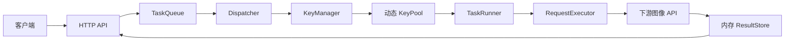
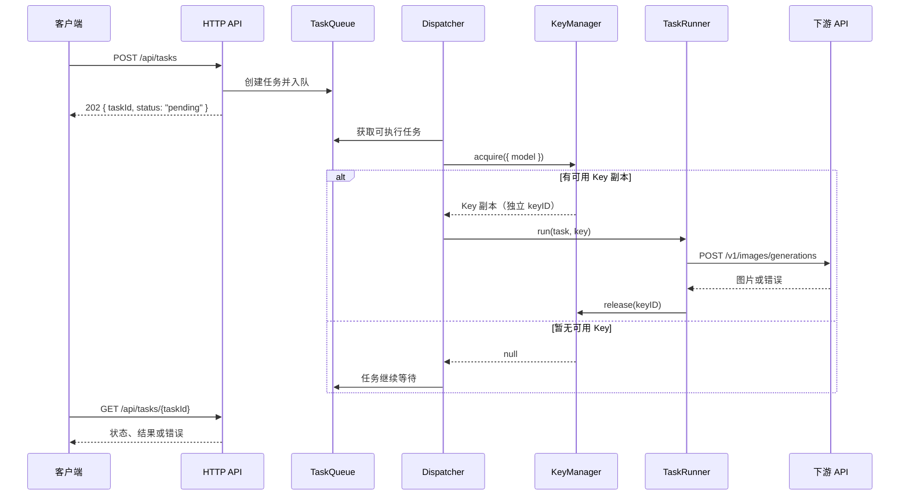

<div align="center">

# Image Relay Station

### 高并发图像生成任务调度中转站

统一接收图像生成请求，通过异步队列和动态 KeyPool，  
将任务调度到多个 OpenAI 兼容的下游服务。


</div>

---

## 项目简介

Image Relay Station 面向需要统一管理大量图像生成 Key 的场景。客户端只需要提交任务并轮询结果；服务端负责排队、选择可用 Key、控制并发、调用下游接口以及处理失败重试。

> 当前仓库处于结构搭建阶段。本文描述的是已经确认的目标架构，功能仍在持续实现中。

## 核心能力

- **异步任务队列**：请求快速入队，避免长时间阻塞客户端连接。
- **动态 KeyPool**：运行时注册、删除和更新原始 Key，无需重启服务。
- **Key 并发复制**：根据 `concurrency` 复制 Key，每个副本拥有独立 `keyID`。
- **模型感知调度**：Core 根据任务模型动态获取匹配的 Key 副本。
- **去重健康检测**：同一个原始 Key 无论复制多少份，每轮只检测一次。
- **自动归还资源**：请求结束后将 Key 副本归还池中，防止并发名额泄漏。
- **可配置吞吐**：调度速率、队列容量、超时和重试均由 `config.json` 控制。
- **内存结果交付**：图片不落盘，客户端领取后即可释放内存。

## 系统架构



### 请求生命周期



## KeyPool 设计

### 原始 Key

`data/apikey_pool.json` 只保存不重复的原始 Key：

```json
[
  {
    "id": "key-a",
    "name": "服务商 A",
    "baseUrl": "https://example.com",
    "apiKey": "sk-xxxxxxxx",
    "models": ["gpt-image-1"],
    "concurrency": 3,
    "enabled": true
  }
]
```

### 并发副本

启动或更新配置时，`KeyFactory` 根据 `concurrency` 创建真正进入 KeyPool 的副本：

```text
原始 Key：key-a，concurrency = 3

KeyPool:
├── keyID: key-a-1  ─┐
├── keyID: key-a-2   ├─ sourceKeyId: key-a
└── keyID: key-a-3  ─┘
```

副本之间：

- `keyID` 不同，分别代表一个可占用的并发名额。
- `sourceKeyId`、`apiKey`、`baseUrl` 和模型能力相同。
- Core 取走一个副本后，该副本暂时离开可用池。
- 请求完成后，Core 按原 `keyID` 归还副本。
- 健康检测按 `sourceKeyId` 去重，不重复测试三个副本。
- 原始 Key 不健康时，其全部副本停止分配。

## Core 设计

```text
server/core/
├── TaskQueue.js        # 等待任务与队列容量
├── TaskState.js        # 任务状态及合法状态转换
├── Dispatcher.js       # 任务与 Key 副本配对
├── TaskRunner.js       # 单任务执行生命周期
├── RequestExecutor.js  # 下游 HTTP 请求
├── RetryPolicy.js      # 错误分类与退避重试
└── ResultStore.js      # 内存结果与过期清理
```

任务状态：

```text
pending ──▶ running ──▶ completed
                 ├────▶ retrying ──▶ pending
                 └────▶ failed

pending ──▶ cancelled
```

设计规则：

1. 同一模型内部保持 FIFO。
2. 队首模型没有可用 Key 时，允许调度其他当前可执行的模型。
3. KeyPool 副本数量就是下游并发容量，不再额外叠加 WorkerPool。
4. 业务重试由 `RetryPolicy` 决定，Key 模块不负责重试。
5. `release(keyID)` 必须放在 `finally` 中，避免副本永久丢失。

## 项目结构

```text
image-relay/
├── package.json
├── package-lock.json
├── config.json
├── README.md
├── .gitignore
│
├── server/
│   ├── index.js
│   ├── bootstrap.js
│   │
│   ├── api/
│   │   ├── routes/
│   │   │   ├── tasks.js
│   │   │   ├── keys.js
│   │   │   └── status.js
│   │   └── schemas/
│   │       ├── taskSchemas.js
│   │       └── keySchemas.js
│   │
│   ├── core/
│   │   ├── TaskQueue.js
│   │   ├── TaskState.js
│   │   ├── Dispatcher.js
│   │   ├── TaskRunner.js
│   │   ├── RequestExecutor.js
│   │   ├── RetryPolicy.js
│   │   └── ResultStore.js
│   │
│   ├── keys/
│   │   ├── KeyManager.js
│   │   ├── KeyStore.js
│   │   ├── KeyFactory.js
│   │   ├── KeyPool.js
│   │   ├── KeySelector.js
│   │   └── HealthTester.js
│   │
│   └── shared/
│       ├── errors.js
│       ├── logger.js
│       └── id.js
│
├── data/
│   └── apikey_pool.json
│
└── test/
    ├── unit/
    │   ├── core/
    │   └── keys/
    ├── integration/
    │   └── task-flow.test.js
    └── benchmark/
        └── benchmark.js
```

## 配置示例

```json
{
  "server": {
    "host": "0.0.0.0",
    "port": 3000
  },
  "queue": {
    "dispatchRatePerSecond": 300,
    "maxPending": 10000
  },
  "request": {
    "timeoutMs": 120000
  },
  "retry": {
    "maxAttempts": 3,
    "baseDelayMs": 1000,
    "maxDelayMs": 30000
  },
  "result": {
    "resultTtlMs": 1800000,
    "deleteAfterRead": true
  },
  "health": {
    "intervalMs": 30000,
    "timeoutMs": 10000,
    "path": "/v1/models"
  }
}
```

> `dispatchRatePerSecond` 是 Core 调度上限；Key 副本总数是下游并发上限；实际图片完成速度仍由下游响应时间决定。

## API 规划

| 方法 | 路径 | 说明 |
|---|---|---|
| `POST` | `/api/tasks` | 创建图像生成任务 |
| `GET` | `/api/tasks/:id` | 查询状态并领取结果 |
| `DELETE` | `/api/tasks/:id` | 取消排队任务 |
| `GET` | `/api/tasks` | 分页查询任务 |
| `GET` | `/api/keys` | 查看原始 Key 和池状态 |
| `POST` | `/api/keys` | 注册 Key 并创建并发副本 |
| `PUT` | `/api/keys/:id` | 修改 Key 和副本数量 |
| `DELETE` | `/api/keys/:id` | 删除 Key 及其副本 |
| `POST` | `/api/keys/:id/toggle` | 启用或禁用 Key |
| `POST` | `/api/keys/:id/health-test` | 手动健康检测 |
| `GET` | `/api/status` | 查看队列和 KeyPool 状态 |

## 开发阶段

- [x] 确认请求生命周期
- [x] 确认 Core 与 Key 模块边界
- [x] 确认 Key 并发复制模型
- [x] 初始化 Git 仓库
- [ ] 完成 Key 模块
- [ ] 完成 Core 模块
- [ ] 完成 HTTP API
- [ ] 补齐单元测试与集成测试
- [ ] 完成压力测试

## Phase 1 边界

Phase 1 暂不引入数据库、Redis、图片落盘、多实例共享队列、用户认证、优先级队列、WebSocket 或 Webhook。服务重启后，内存任务和结果不保证恢复。

---

<div align="center">

**Queue the work. Lease the key. Return the result.**

</div>
